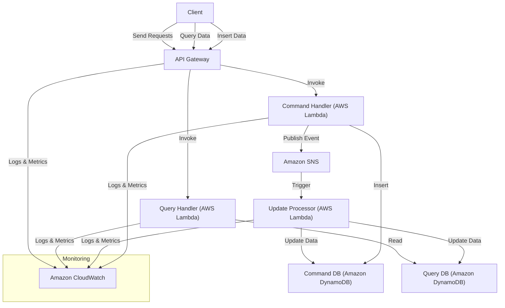

# CQRS Pattern on AWS

This repository implements the **CQRS (Command Query Responsibility Segregation) Pattern** using AWS services, including AWS Lambda, Amazon DynamoDB, Amazon SNS, and AWS API Gateway. The CQRS Pattern separates read and write operations for a data store, optimizing them independently for performance and scalability.

## 🏗️ Architectural Overview


The **CQRS Pattern** architecture consists of the following components:

1. **API Gateway**: Acts as the main entry point for both command and query operations.
2. **Command Handler Lambda**: Handles data insertion (command) operations and publishes events to **Amazon SNS**.
3. **Update Processor Lambda**: Listens to events from **Amazon SNS** and updates both the **Command DB** and **Query DB**.
4. **Query Handler Lambda**: Handles data retrieval (query) operations by accessing the **Query DB**.
5. **Amazon SNS**: Serves as the event streaming platform for processing events.
6. **Amazon DynamoDB**: Used for both command (write) and query (read) operations.
7. **Amazon CloudWatch**: Monitors logs, metrics, and telemetry data from all the services.

### 📊 AWS CQRS Architecture Diagram



## 📂 Repository Structure

```
/aws-cqrs-pattern
│
├── README.md                                   # Root README with architecture overview and getting started
├── LICENSE                                     # MIT License
│
├── infrastructure
│   ├── README.md                               # README for Infrastructure deployment
│   ├── cloudformation-template.yml             # CloudFormation template for all AWS resources
│   └── .github/workflows/deploy-cloudformation.yml # GitHub Action to deploy AWS resources
│
├── api-gateway
│   ├── README.md                               # README for API Gateway
│   ├── ApiSpec.yaml                            # OpenAPI specification for API Gateway
│   └── .github/workflows/deploy-api-gateway.yml # GitHub Action to deploy API Gateway
│
├── command-handler
│   ├── README.md                               # README for Command Handler Lambda
│   ├── CommandHandler.cs                       # C# code for Command Handler Lambda
│   └── .github/workflows/deploy-command-handler.yml # GitHub Action to deploy Command Handler Lambda
│
├── update-processor
│   ├── README.md                               # README for Update Processor Lambda
│   ├── UpdateProcessor.cs                      # C# code for Update Processor Lambda
│   └── .github/workflows/deploy-update-processor.yml # GitHub Action to deploy Update Processor Lambda
│
└── query-handler
    ├── README.md                               # README for Query Handler Lambda
    ├── QueryHandler.cs                         # C# code for Query Handler Lambda
    └── .github/workflows/deploy-query-handler.yml # GitHub Action to deploy Query Handler Lambda
```

## 🚀 Getting Started

### Step 1: Deploy the Infrastructure

1. Navigate to the **`infrastructure`** folder.
2. Follow the instructions in the [Infrastructure README](infrastructure/README.md) to deploy the required AWS resources using the CloudFormation template and GitHub Actions.

### Step 2: Deploy the AWS Lambda Functions and API Gateway

1. Deploy the **Command Handler Lambda**:
   - Navigate to the **`command-handler`** folder.
   - Follow the instructions in the [Command Handler Lambda README](command-handler/README.md) to deploy the function using GitHub Actions.

2. Deploy the **Update Processor Lambda**:
   - Navigate to the **`update-processor`** folder.
   - Follow the instructions in the [Update Processor Lambda README](update-processor/README.md) to deploy the function using GitHub Actions.

3. Deploy the **Query Handler Lambda**:
   - Navigate to the **`query-handler`** folder.
   - Follow the instructions in the [Query Handler Lambda README](query-handler/README.md) to deploy the function using GitHub Actions.

4. Deploy the **API Gateway**:
   - Navigate to the **`api-gateway`** folder.
   - Follow the instructions in the [API Gateway README](api-gateway/README.md) to deploy the API Gateway using GitHub Actions.

## 💡 How It Works

1. **Insert Data**:
   - The **Command Handler Lambda** handles data insert operations and publishes events to **Amazon SNS**.
   - The **Update Processor Lambda** listens to these events and updates both the **Command DB** and **Query DB**.

2. **Query Data**:
   - The **Query Handler Lambda** handles data retrieval (query) operations from the **Query DB**.

## 📄 License

This project is licensed under the MIT License - see the [LICENSE](LICENSE) file for details.

## 🙌 Contributing

Contributions are welcome! Please open an issue or submit a pull request for any improvements or suggestions.
